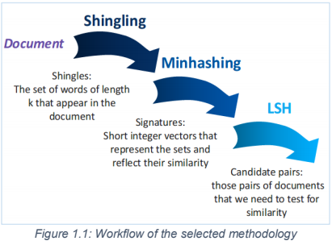

# Document Similarity
## Introduction
The purpose of this project was to process a dataset of articles in order to measure similarity amongst thems, by implementing a variety of methods. The dataset under examination was the Reuters-21578 collection. The project was developed in R.

Similarity between document can be defined as the percentage of their common components. One of the most frequent methodologies for this computation is the following:
- Step 1 - Shingling: Each document is broken down to its structural elements (shingles). In this implementation, each shingle contains k number of words.
- Step 2 - Minhashing: For improved algorithm's performance, representative transformations of shingles (signatures) are extracted in a way that preserves similarity.
- Step 3 - LSH: Signatures are appropriately used to map documents into buckets so that similar documents are more likely to land withing the same bucket.
- Step 4 - Document Comparison: Similarity is computed based on the assumption that only documents from the same bucket are likely to be similar  to each other. Hence, calculations are performed just for nearest neighbor's pairs.

A commonly used metric for document comparison is Jaccard similarity, i.e. the ratio of the shared components between two different documents (intersection) to their total distinct number (union). Jaccard similarity can be computed with the use of either shingles or signatures, since the main principle of minhashing is that the similarity of signatures is on expectation close to the similarity of shingles.

## Data Preprocessing

### Transforming and Cleaning of the dataset
Upon completion of the loading, any empty rows that occurred due to the splitting process were removed. The next step was to extract from each article the value of OLDID attribute, in order to be used as the unique identifier of each document, while the main text was identified in between the start tag <BODY> and the close tag </BODY>. Since the tag is optional, all articles where this tag is absent were discarded.

Further cleaning actions were performed in order to refine the main text:
- Removal of '\n' character (line change indicator)
- Conversion to lowercase
- Exclusion of any non-letter characters (punctuation, numbers and other symbols)
- Removal of additional white spaces between words

### Splitting documents into words
Once data cleaning was finished, the main text of each document was split into its constituent words. At this point, documents with less that 8 words were excluded thus allowing us to construct up to 7-word shingles.

## Shingling
Shingling is the most effective way to represent documents as sets.
A shingling function was created to generate the k-word shingles of a single document and return the distinct set of them (value of k adjustable by user). Shingles are produces following a sliding window rule of k size.

The function was applied across all documents in order to construct for each one of them the set of --shingles that appear at least once within that document.

Each one of the unique shingles was associated with an unrepeated integer using a hash table structure, i.e. a dictionary that maps keys to values one to one. Hash maps are known for being reasonably fast lookups. Hence, the minhashing process with hash functions in the form of h(x)=(ax+b)mod c could be implemented.

## Minhashing
Minhashing is an important step in the efficient computation of document similarity. Having split the initial document into shingles, the Jaccard similarity can be calculated. However this will not scale well, as for a given document the retrieval of all other documents that are the closest/most similar to it requires heavy computations.

In order to improve performance and relieve the computational burden, this method proposes that for each document the set of k-shingles be replaced by a number of transformed representatives (signatures) that are generated through the use of appropriate hash functions.

The steps that were followed for the computation of the signatures are listed below:
- A hash function of the form h(x) = (a⋅x +b) mod c was produced in order to calculate the hash value for every shingle per document.
- The minimum hash value found on the previous step was selected for each document as a representative (signature).
- To obtain h representatives, the process was repeated h times for different values of a and b (value of h defined by user).

The choice of the minimum hash value is actually a rule of thumb and is equivalent to the random choice, as for each input a good hash algorithm is supposed to generate a “random” output that is equally likely to be large or small.

Regarding the parameter choice, a and b were integers sampled without replacement from a uniform distribution with range [1, N], where N stands for the number of distinct shingles across all documents. In addition, c was set equal to the first prime number greater than the total number of unique shingles.

Furthermore, in order to avoid integer overflow during a⋅x multiplication, the following properties were applied on the hash functions of the form h(x) = (a⋅x +b) mod c:
[(x mod w)+(y mod w)] mod w =(x +y) mod w
[(x mod w)⋅(y mod w)] mod w =(x ⋅ y) mod w

Which resulted in the following transformation:
h(x)=[(a mod c)⋅(x mod c) mod c +(b mod c)] mod c

## Locality Sensitive Hashing (LSH)

Minhashing manages to reduce significantly the number of calculations required for the comparison of two documents. However, in order to retrieve similar documents, all-pairs computation is still necessary, which is quadratic in the number of signatures.
To overcome this obstacle, Locality Sensitive Hashing (LSH) method is used. The main idea is to create mini-signatures, i.e. b bands containing r signatures. Each mini-signature is then hashed to a unique bucket via an appropriate hash function. Thus, candidate pairs are derived from documents mapped to the same bucket for at least one band.

The following steps were implemented across all documents:
- For the chosen band size (value adjustable by user), the document’s signatures were split into separate mini-signature vectors (bands).
- Each band vector was then transformed into a unique string, constructed from the concatenation of all members, with underscore as separator. For example, a band containing the signature values (15, 355, 89, 2) would generate the following string: “15_355_89_2”
- Each string was hashed to a unique hexadecimal number (bucket) by using CRC-32 (Cyclic Redundancy Check) algorithm as a hash function.
Eventually, all documents were mapped to a specific bucket per band. Thus, all information necessary for the search of nearest neighbors was available at this point.

## Document Neighbors

Upon completion of the LSH step, searching for documents similar to the one under examination is based on a crucial assumption: that only documents that have been hashed at least once into the same bucket (neighbors’) across all bands are likely to be similar to each other - all other document pairs are not taken into consideration. Hence, for the retrieval of the n nearest neighbors, Jaccard similarity should be calculated only for a significantly low number of candidate pairs.

The nearest neighbor query was constructed as follows:
- For the chosen document (document OLDID provided by user), the respective bucket ids across all bands were retrieved.
- Per band, all documents with the same bucket ids as the document under examination were collected, thus creating a list of candidate neighbors.
- For all candidate pairs, i.e. selected document - candidate neighbor, Jaccard similarity of signatures was calculated. Original similarity, i.e. using shingles instead of signatures, was computed as well for comparison and further analysis.
- Finally, all neighbors were sorted by descending signature similarity and the top n findings (value of n defined by user) were returned.

It must be noted that a special treatment has been implemented for documents without any neighbors or documents with less neighbors in total than the requested number of n nearest.
